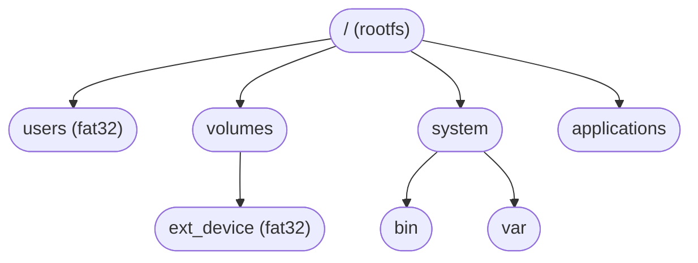

# ProtOS's filesystem

```mermaid
flowchart
    root(["/ (rootfs)"]) --> home(["users (fat32)"])
    root --> volumes(["volumes"])
    root --> system(["system"])
    root --> applications(["applications"])
    system --> bin(["bin"])
    system --> var(["var"])
    volumes --> ext1(["ext_device (fat32)"])
```
